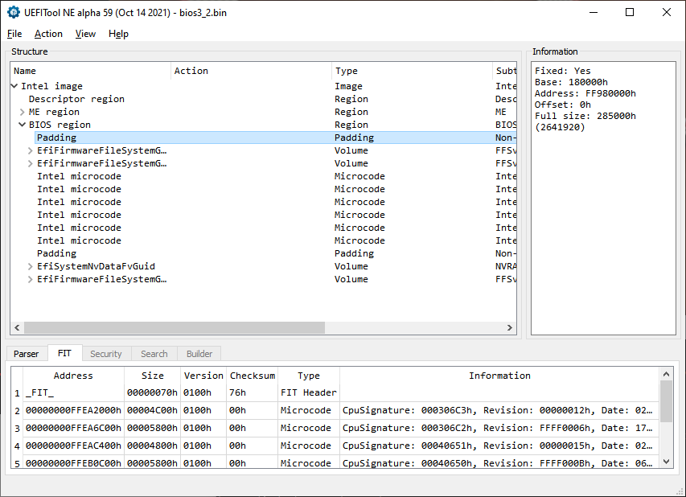

# Lenovo BIOS password cracker

This little utility script will allow you to recover your forgotten BIOS password from a Lenovo laptop.

Tested on:
- Lenovo G510
- Lenovo Z51-70

And will probably work on many other models (feel free to open an Issue to report successes).

⚠️ **Do not use for illegal purposes!**
Only use with devices that you legally own.
The author is not responsible for irresponsible usage.

## Instructions

### Prerequisites

You will need a dumped image of your UEFI chip from the motherboard. For this you need a physical hardware which is a programmer and a SOIC chip, just like in [this video](https://www.youtube.com/watch?v=2Y06x1f22B0) (a wonderful tutorial btw). If you don't have one, stop right here, analyzing the chip dump is the only way to extract the password.

You also need node.js installed on your system.

### UEFITool NE

After obtaining your BIOS image, open it in [UEFITool NE](https://github.com/LongSoft/UEFITool), and extract the first `Padding` file as is.



### Run

```shell
node crack.mjs Padding_Non-empty_Padding.pad
```

(where `Padding_Non-empty_Padding.pad` is the padding file that you have extracted)

Example output:
```
Lenovo sussy baka BIOS password cracker by p0358
================================================
┌──────────────────┬───────────┐
│     (index)      │     0     │
├──────────────────┼───────────┤
│ CRACKED PASSWORD │ 'PASS123' │
└──────────────────┴───────────┘
```

✅ Your cracked password is thus `PASS123`. Enjoy.

If it does not work, sometimes pointing it at the whole BIOS image dump might prove effective as the last resort. If not, you're not of luck, your BIOS probably isn't supported.

## How does it work?

The device searches the whole binary file for a valid pattern containing an encoded password. It attemps to read it out from every possible file offset, since for every different device and BIOS version the offset would differ.

The password is saved with the following pattern on the chip:
```
07 19 1E 1F 1F 02 03 04 7B
```

The first byte is the password length, which can be between 1 and 8. It is followed by the password bytes typed out as the keyboard scan codes that map directly to the raw keyboard keys. The sequence is ended up with a checksum byte. A correct sequence will have all of these bytes summed up (including the length and checksum byte) with a result of 00h on the least significant byte.

The scanner analyzes all possible patterns, filtering them for validity of checksum and keys of which they are comprised, this way we do not have to care about the format of the rest of the file.

## Other stuff

Check out also my article about removing the WLAN card whitelist on the very same laptop I wrote a while back:
https://medium.com/@p0358/removing-wlan-wwan-bios-whitelist-on-a-lenovo-laptop-to-use-a-custom-wi-fi-card-f6033a5a5e5a
